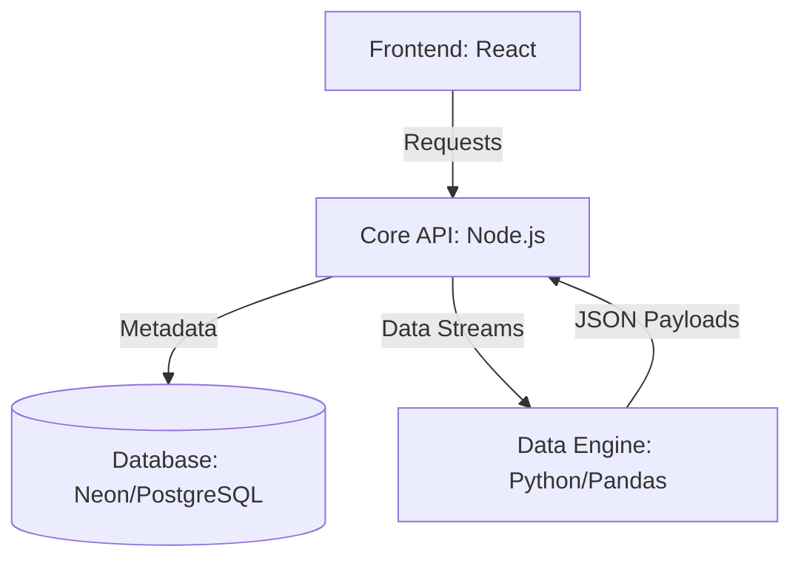

<div align="center">
  
</div>

<h1 align="center"><strong>Gotham's Analytical Data Engine 🦇</strong></h1>

<br/>
<div align="center">
  
</div>
<br/>

**BatBI** is a high-fidelity, full-stack Business Intelligence (BI) platform with a sleek *Goth/Dark* aesthetic, designed to process large data volumes smoothly and intuitively. The ecosystem enables both no-code file mapping via drag-and-drop (`.csv`) and dynamic runtime connections to external relational databases, generating instant executive reports complete with interactive charts, automated KPI cards, and native PDF exports.

---

## 🚀 Core Features

* **No-Code CSV Mapping:** Seamless drag-and-drop upload for files up to 100MB with strict client-side file size and type validation.
* **Dynamic SQL Connections:** Direct, runtime connection setup to external PostgreSQL databases with native TLS/SSL support for secure cloud environments.
* **Hybrid Data Engine:** An asynchronous architecture where **Node.js** handles server infrastructure, routing, security, and metadata persistence, while **Python (Pandas)** acts as a high-performance mathematical calculation engine.
* **Real-Time KPI Cards:** Instant calculation of Cumulative Total, Global Average, and Peak Maximum directly from aggregated metrics.
* **High-Fidelity Dashboard UI:** A highly responsive analytical interface built in React, offering fluid, interactive charts and layout state management.
* **Executive PDF Export:** Automated, server-side PDF report generation via Puppeteer that captures the exact dashboard UI state, injecting a Recharts Base64 snapshot alongside clean, structured data tables.

---

## 🛠️ Tech Stack

### Frontend
- **React.js (v18)** with **TypeScript**
- **Vite** (Next-generation high-speed build tool)
- **Tailwind CSS** (Utility-first CSS framework)
- **Recharts** (Interactive and responsive charting)

### Backend & Data-Engine
- **Node.js + Express** (Enterprise REST API)
- **Prisma ORM** (Database modeling and querying)
- **PostgreSQL / Neon Database** (Cloud-native meta-database for tracking session history)
- **Python 3** (Data analytics engine powered by **Flask** and **Pandas**)
- **Puppeteer** (Chromium automation for pixel-perfect PDF rendering)

### Security
- **JWT (JSON Web Tokens)** for stateless session protection and route guards.
- **Bcrypt** for strict password hashing and salting.

---

## 📐 System Architecture

The ecosystem operates under an integrated microservices-inspired architecture:



1. **Frontend (React):** Captures user interactions, files, and credentials, running validation checks to eliminate invalid server requests.
2. **Core API (Node.js):** Verifies user sessions, logs analytic histories inside the metadata store (Neon), and initializes runtime connections to third-party customer databases.
3. **Python Engine:** Receives raw data streams (via file byte buffers or structured queries) and executes rapid data manipulations using Pandas, returning a clean, typed JSON payload.

---

## 🛠️ Local Setup Guide

### Prerequisites
- Node.js installed (v18+)
- Python 3 installed (with `pip`)
- An active PostgreSQL database instance (local or hosted via Neon)

### 1. Clone the Repository
```bash
git clone [https://github.com/your-username/batbi.git](https://github.com/your-username/batbi.git)
cd batbi
```
### 2. Configure the Core API (Node.js Backend)

Navigate to the backend directory and install the required packages:
```bash
cd backend
npm install
```
Create a `.env` file in the root of the backend folder using the following template:
```snippet
# Database Settings (Neon)
DATABASE_URL="your_postgresql_database_url"

# JWT Secret Key
JWT_SECRET="your_gotham_secure_jwt_secret"

# External Database Security Settings
# Options: true (enforces SSL), false (disables SSL), self (allows self-signed certificates)
DB_EXTERNAL_SSL=true
```
Run Prisma migrations and spin up the development server:
```bash
npx prisma migrate dev
npm run dev
```
### 3. Spin Up the Analytical Engine (Python)

Navigate to the data-engine directory, initialize and activate the virtual environment, install the dependencies, and start the Flask service:
```bash
cd ../data-engine
```

Create the virtual environment (if not already created):
```bash
python -m venv venv
```

Activate the virtual environment:

* On Windows:
```bash
venv\Scripts\activate
```
* On macOS/Linux:
```
source venv/bin/activate
```
Install dependencies inside the virtual environment:
```
pip install pandas flask flask-cors form-data
```
Start the engine:
```
python app.py
```
### 4. Run the Interface (React Frontend)

Navigate to the frontend folder and install dependencies:
```bash
cd ../frontend
npm install
```
Create a `.env` file in the root of the frontend folder using the following template:
```snippet
# Backend URL (usually http://localhost:3000/api/v1)
VITE_API_URL=your_backend_url
```
Start Vite:
```bash
npm run dev
```

Open your browser and navigate to the local address displayed (usually `http://localhost:5173`) to access the analytical dashboard.

---

## 🚀 Development Checklist & Progress

### 📁 Phase 1: Core Engine (Local MVP)
*Focus on establishing low-latency inter-process communication between Node.js and Python.*
- [x] **Environment Setup:** Configured multi-language runtime dependencies.
- [x] **The Data Engine (Python):** Initialized Pandas analytics core with Flask orchestration.
- [x] **The Orchestrator (Node.js):** Established baseline infrastructure, core routing, and subprocess spawning.

### 🔐 Phase 2: Metadata Store & System Security
*Focus on structured schema modeling and engineering route guards against anonymous access.*
- [x] **Application Database:** Implemented user tracking and history persistence via Prisma ORM & Neon PostgreSQL.
- [x] **Stateless Authentication:** Engineered robust Signup/Login pipelines secured with Bcrypt hashing and JWT signatures.
- [x] **Route Guards:** Written automated Express middleware to intercept and validate incoming authorization headers.
- [x] **Environment Security:** Centralized runtime variable injection and strong typing via dedicated configuration modules.
- [x] **Dynamic Stream Ingestion:** Bound Multer file storage buffers to target execution arguments inside Python.

### 🎨 Phase 3: High-Fidelity Dashboard (React + Vite + Tailwind)
*Focus on translating Gotham's dark aesthetic into an intuitive, high-performance analytic client application.*
- [x] **Client-Side Setup:** Clean modern boilerplate built on React + TypeScript, compiled with Vite.
- [x] **Styling Infrastructure:** Integrated utility-first layout management via Tailwind CSS.
- [x] **Gatekeeper Module:** Designed accessible, responsive custom dark-themed Login and Register views.
- [x] **Session Persistence:** Configured storage drivers to securely hold dynamic token state locally.
- [x] **Client Routing Guards:** Wired dynamic layout wrappers (`PrivateRoute`) to protect unauthorized frontend views.
- [x] **The Central Dashboard:** Assembled interactive file drop targets alongside native metric visualization engines.
- [x] **Session Destruction:** Implemented client memory cleanup utilities on user logout events.

### 🔌 Phase 4: Dynamic SQL Connections (The Runtime Gateway)
*Focus on abstracting external infrastructure layers to query distinct live third-party relational instances.*
- [x] **Credential Interface:** Constructed safe input forms to capture database routing keys (*Host, User, Port, DB Name*).
- [x] **Dynamic Context Adapters:** Written programmatic database pooling in Node.js with native cloud TLS/SSL enforcement toggles.
- [x] **Schema Mapping Subsystem:** Engineered discovery queries to fetch available external schemas, letting users map table parameters directly to custom coordinate axes.

### 📄 Phase 5: Advanced Analytics & Corporate Utilities
*Focus on adding business-centric value metrics and robust document export automation.*
- [x] **KPI Aggregation Cards:** Enabled real-time interface widgets compute running summaries from multidimensional arrays.
- [x] **Executive PDF Exporter:** Configured server-side Headless Chromium automation via Puppeteer to render and download layout snapshots on demand.
- [x] **Graceful Error Handling:** Wrapped operational connection failures and missing table schemas in friendly UI alerts.

---

## 🗺️ Roadmap & Future Implementations

As part of the continuous evolution plan for the platform, the following features are mapped out:

- [ ] **Dynamic Drag-and-Drop Canvas:** Allow users to freely resize and rearrange charts and KPI cards across the screen.
- [ ] **Multi-Axis Y Plotting:** Add frontend support to display multiple numeric metrics on the same chart concurrently.
- [ ] **Extended Data Connectors:** Build out native connection adapters for MySQL, SQL Server, and `.xlsx` worksheets.
- [ ] **Global Advanced Filters:** Implement temporal and categorical interactive sliders impacting all dashboard widgets simultaneously.
- [ ] **Customized Codes:** Empower users to write or inject custom Python snippets for advanced querying and personalized plotting with low latency.

---

## 📄 License

This project is licensed under the MIT License. See the [LICENSE](LICENSE) file for more details.

---

## 💖 Support the Project

If **BatBI** helped you optimize your data workflow or inspired your next full-stack architecture, consider supporting its continuous development! 

* [Become a Sponsor on GitHub Sponsors](https://github.com/sponsors/ramonesreal)
* [Buy Me a Coffee ☕](https://www.buymeacoffee.com/ramonesreal)

---

## 👨‍💻 Developed by:

* 🦇 **Ramon Lima**

* 🔗 **My LinkedIn:** [Ramon Lima](https://www.linkedin.com/in/ramonesreal/)
